# MINTIME-DF Multi-Identity size-iNvariant TIMEsformer for Video Deepfake Detection


# [Paper](https://ieeexplore.ieee.org/document/10547206)

[](https://paperswithcode.com/sota/classification-on-forgerynet?p=mintime-multi-identity-size-invariant-video)

## Motivations behind this study
The continuing advancement of deepfake generation techniques and the increasingly credible results obtained through these, makes it increasingly urgent to develop new techniques to distinguish a manipulated video from a real one. This is, however, a far from simple task that introduces multiple challenges to be overcome, challenges that form the basis of this research work. 
- <b>Generalization of the Deepfake concept</b>:  Deepfake generation methods tend to introduce specific anomalies within images and videos. Deepfake detection models often tend to learn to recognise these specific anomalies and are therefore ineffective in the real world when dealing with unseen manipulations. Our previous studies in this area suggest a greater capacity for generalisation by Vision Transformers than by Convolutional Neural Networks [<a href="https://arxiv.org/abs/2206.13829">Coccomini et al, 2022</a>];
- <b>Ability to pick up both spatial and temporal anomalies within a video</b>: Very often the anomalies that are searched for by deepfake detectors are exclusively spatial with frame-by-frame classifications. However, some important anomalies lie precisely in the variation of the face over time, which can be unnatural and thus allow a manipulated video to be identified;
- <b>Handling of multiple faces within the same video</b>: A specific situation that can be exploited by an attacker to deceive a deepfake detection system is found in the case of videos or images with multiple faces (identities). An attacker could in fact decide to manipulate only one of the people in the video. However, if the detection is carried out en bloc for all the faces in the video, the negative contribution to the final prediction made by the fake faces could be 'masked' by the non-manipulated ones, thus deceiving the system.
- <b>Management of different face-frame area ratios</b>: Typically in deepfake detection systems, the person's face is extracted from the video or image to be classified and before being given as input to a neural model it is rescaled to be uniform with all the others. This results in an important loss of information, namely the ratio of the area of the subject's face to the rest of the scene.

To solve all these problems, we propose a Size-Invariant Multi-Identity Transformer-based architecture which exploits a novel form of Divided Space-Time attention. 
The new features, strengths and advantages introduced by our approach are as follows:
- Ability of our model to capture both spatial and temporal anomalies in a deepfake video by jointly exploiting both a convolutional network and a variant of the Transformer namely the TimeSformer;
- Ability to handle multi-identity cases effectively. In previous approaches, there is a tendency to ignore people who appear with a lower frequency in the video and to only analyze faces extracted from the most frequent identity. However, in the real world, this can result in a flaw that can be exploited by an attacker who might, for instance, deliberately decide to manipulate a face of an identity that appears for a smaller portion of the video than others and thus escape the deepfake detection algorithms. Our approach, through the introduction of several architectural innovations such as 'Adaptive Input Sequence Assignment', 'Temporal Positional Embedding' and 'Identity-based Attention Calculation', is able to handle any number of identities while remaining robust in terms of classification accuracy. The Adaptive Sequence Assignment approach is designed to construct the input sequence to the model coherently even in the presence of multiple identities. Temporal Positional Embedding is a modification to the classical positional embedding of Transformers that keeps tokens not only spatially but also temporally consistent in terms of the identities to which they belong. Finally, Identity-based Attention calculation is a particular way of calculating attention that we have developed so that the network first focuses separately on the different identities that occur in the video and then converges to a single CLS token that is influenced by and common to all of them. This CLS is finally used for the final video-level classification.
- Ability to handle different face-frame area ratios through the introduction of 'Size Embedding'. Typically in deepfake detection systems, the person's face is extracted from the video or image to be classified and before being given as input to a neural model it is rescaled to be uniform with all the others. This results in an important loss of information, namely the ratio of the area of the subject's face to the rest of the scene. This may be reflected in missclassification with faces with a particular ratio being classified as fakes even though they are not.
- Explainability of the results by analyzing the attention maps produced by the model. By looking at the attention values assigned by the model to the tokens associated with the individual faces as input, it is possible to obtain a more refined classification that is not only limited to saying whether or not the video is fake but also which of the multiple identities, if any, were manipulated and at what point in the video.
- Near state-of-the-art results on ForgeryNet dataset.
- Generalization capability on unseen deepfake generation methods demonstrated by analyzing the results obtained on approaches not considered in the training set obtaining or surpassing state-of-the-art accuracies on all setups.
  

## Setup
Clone the repository and move into it:

```
git clone https://github.com/davide-coccomini/MINTIME-Multi-Identity-size-iNvariant-TIMEsformer-for-Video-Deepfake-Detection.git

cd MINTIME-Multi-Identity-size-iNvariant-TIMEsformer-for-Video-Deepfake-Detection
```

Setup Python environment using conda:

```
conda env create --file environment.yml
conda activate deepfakes
export PYTHONPATH=.
```


## Run Deepfake Detection on a video
If you want to directly classify a video using pre-trained models, you can download the weights from the model zoo and use the following command:

```
python3 predict.py --video_path path/to/video.mp4 --model_weights path/to/model_weights --extractor_weights path/to/extractor_weights --config config/size_invariant_timesformer.yaml
```

The output video will be stored in the examples/preds folder:


For purposes of explainability the attention maps on the various slots of the input sequence are also saved. These are used to discover, in the multi-identity case, which identity is fake in each frame.

In the following example, the 16 slots are distributed between the two identities according to the number of available faces, the first 6 for identity 0 (the man), the second 6 for identity 1 (the woman). The remaining 4 slots are ignored as there are no additional faces to fill them. 
The attention values extracted from the various heads are combined considering the maximum values for each tokens. The tokens are then grouped according to the frame and identity they refer to, resulting in 16 attention values (of which 4 are null). The spatial and temporal attention is combined to obtain the final value via the average function. Finally, the softmax function is applied to emphasise the differences between the attention placed on one face rather than another.

In this case, the attention in frame 20 of the second identity is particularly high, which indicates that there is an anomaly there.

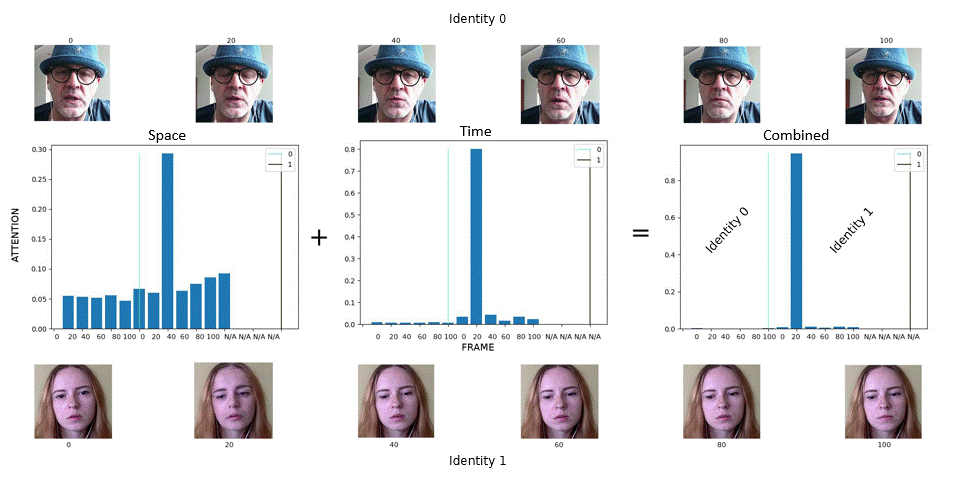

## Model ZOO

To download the pre-trained models available <a href="https://drive.google.com/drive/folders/1ti3U5jZULTgwx-sik9XjJDEB1_2hAsgi?usp=sharing">click here</a>.

### Models comparison
| Model | Identities | Accuracy | AUC  |
| --------------- | --------------- | --------------- | --------------- | 
| MINTIME-XC | 1 | 85.96 | 93.20 |
| MINTIME-XC | 2 | 87.64 | 94.25 |
| MINTIME-XC | 3 | 86.98 | 94.10 |
| SlowFast R-50 Retrained | 1 | 82.59 | 90.86 |
| SlowFast R-50 | 1 | 88.78 | 93.88 | 
| X3D-M | 1 | 87.93 | 93.75 |
| MINTIME-EF | 1 | 81.92 | 90.13 | 
| MINTIME-EF | 2 | 82.28 | 90.45 |
| MINTIME-EF | 3 | 82.05 | 90.28 |
| EfficientNet-B0 + MLP | 1 | 65.33 | 71.42 |
| EfficientNet-B0 + MLP | 2 | 67.03 | 71.05 |
| EfficientNet-B0 + MLP | 3 | 66.89 | 70.92 |


###  Multi-Identity videos only
Accuracy obtained from models on multi-identity videos only.

| Model | Accuracy | AUC |
| ----  |   ----   | ---- |
| MINTIME-XC | 86.68  | 94.12 |
| MINTIME-EF | 81.21  | 89.56 |
| SlowFast R-50 Retrained | 72.63 | 80.92 |
| EfficientNet-B0 + MLP | 67.69 | 74.26 |


###  Per-class accuracy
Accuracy obtained by the models on the various deepfake generation methods in the test set.
| Model |Pristines | Method 1 | Method 2 | Method 3 | Method 4 | Method 5 | Method 6 | Method 7 | Method 8 | FPR |
| --------------- | --------------- | --------------- | --------------- | --------------- | --------------- | --------------- | --------------- | --------------- | --------------- | --------------- |
| MINTIME-XC              | 88.15   |  79.94   |  84.64   | 82.17    |   84.05  |  77.59   |  85.37   |  92.03   | 79.91 |  14.06 |
| MINTIME-EF              | 85.84   |  70.05   |  69.75   |  74.55   |   82.05  |  78.14   |  79.59   |  91.49   |  77.03   | 14.16 |
| SlowFast R-50 Retrained | 84.65 | 69.70 | 71.71 | 81.19 | 81.35 | 78.67 | 88.43 | 88.96 | 92.05 | 15.34 | 22.36 |
| EfficientNet-B0 + MLP | 51.68   |  67.67   |  84.41   |  67.58   |   65.80  |  78.68   |  69.72   |  92.87   |  79.04   | 48.31 |


### Size Embedding evaluation
| Model | Identities| Accuracy | AUC  |
| --------------- | --------------- | --------------- | --------------- | 
| MINTIME-EF with size-embedding | 2 | 82.05 | 90.28 |
| MINTIME-EF w/o size-embedding | 2 | 81.83 | 90.13 |
| MINTIME-XC with size-embedding | 2 | 87.64 | 94.25 |
| MINTIME-XC w/o size-embedding | 2 | 87.13 | 94.03 |


### Cross-Forgery Analysis

|                 |                 | ID-replaced     | ID-remained     | Identities      |                 
| --------------- | --------------- | --------------- | --------------- | --------------- |
|                 |                  | Accuracy  | Accuracy  |                 |                 
| X3D-M           |  ID-replaced     |  87.92  | 55.25   |       1         |
|                 |  ID-remained     |  55.93  | 88.85   |                 |
| SlowFast        |  ID-replaced     |  88.26  | 52.64   |       1         |
|                 |  ID-remained     |  52.70  | 87.96   |                 |
| MINTIME-XC      |  ID-replaced     |  86.58  | 84.02   |       2         |
|                 |  ID-remained     |  64.01  | 92.08   |                 |
| MINTIME-EF      |  ID-replaced     |  80.18  | 79.03   |       2         |
|                 |  ID-remained     |  63.13  | 89.22   |                 |

|                 |                 | ID-replaced     | ID-remained     | Identities      |                 
| --------------- | --------------- | --------------- | --------------- | --------------- |
|                 |                  |  AUC   |  AUC  |                 |                 
| X3D-M           |  ID-replaced     |  92.91 |  65.59|       1         |
|                 |  ID-remained     |  62.87 |  95.40|                 |
| SlowFast        |  ID-replaced     |  92.88 |  64.83|       1         |
|                 |  ID-remained     |  61.50 |  95.47|                 |
| MINTIME-XC      |  ID-replaced     |  93.66 |  88.43|       2         |
|                 |  ID-remained     |  68.53 |  97.26|                 |
| MINTIME-EF      |  ID-replaced     |  83.86 |  86.98|       2         |
|                 |  ID-remained     |  66.26 |  95.02|                 |

### Cross-Dataset Analysis
| Model | Identities | AUC   |
| --------------- |  --------------- | ---------------  |
| Face X-ray | 1 | 65.50 |
| Patch-based | 1 | 65.60 |
| DSP-FWA | 1 | 67.30 |
| CSN | 1 | 68.10 |
| Multi-Task | 1 | 68.10 |
| CNN-GRU | 1 | 68.90 |
| Xception | 1 | 70.90 |
| CNN-aug | 1 | 72.10 |
| LipForensics | 1 | 73.50 |
| FTCN | 1 | 74.00 |
| RealForensics | 1 | 75.90 |
| MINTIME-EF | 2 | 68.57 |
| MINTIME-XC | 2 | 77.92 |


### Multi-Identity Approaches evaluation
Considering only multi-identity videos

| Model | Identities | Temporal Positional Embedding | Multi-Identity Attention | AUC |
| --------------- | --------------- | --------------- | --------------- | --------------- |
| MINTIME-XC | 2  |      ✓                            |      ✓         |        94.12    | 
| MINTIME-XC | 2  |      X                            |      X         |         93.29    |  
| MINTIME-XC | 3  |      ✓                            |      ✓         |       93.32     |  
| MINTIME-XC | 3  |      X                            |      X         |        90.57     |  


## Dataset
In order to conduct our research, it was necessary to analyse the various datasets in circulation in order to identify the one with the following characteristics:
- Containing a sufficient number of videos for effective training;
- Presence of multi-faces videos;
- Multiple face-frame area ratios present in the videos;
- Large variety of subjects, scenes, perturbations, manipulation techniques. 

For these reasons, ForgeryNet was chosen as the dataset for our experiments. It is in fact characterised by a number of videos equal to 221,247 divided into 99,630 pristine videos and 121,617 manipulated ones with a frame rate between 20 and 30 FPS and variable duration.
From an analysis conducted during our research, we identified the presence of 11,785 video multi-faces with a maximum of 23 faces per video. The face-frame area ratio also appears to be highly distributed with videos containing faces covering an area up to almost, in some rare cases, even 100% of the entire image.

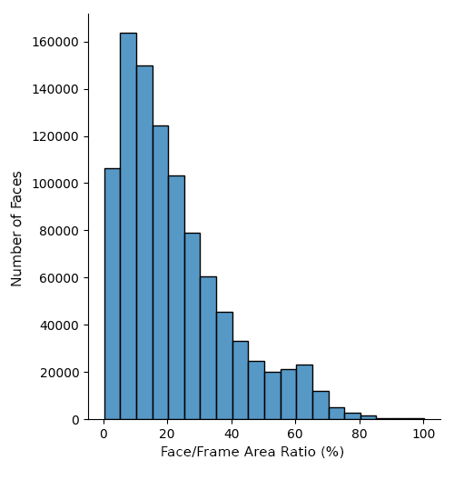

Furthermore, the EfficientNet B0 used as a patch extraction backbone was trained in <a href="https://arxiv.org/abs/2107.02612">our previous research work</a> on the DFDC and FaceForensics++ datasets.

The datasets can be downloaded at the following links:
- ForgeryNet: https://yinanhe.github.io/projects/forgerynet.html#download
- DFDC: https://dfdc.ai/
- FaceForensics++: https://github.com/ondyari/FaceForensics/blob/master/dataset/


## Preprocessing
In order to use the proposed model, some preprocessing steps are required to convert the ForgeryNet into the desired format.

In case you want to retrain the convolutional backbone patch extraction the preprocessing of DFDC and FaceForensics++ datasets, the procedure is described in <a href=https://github.com/davide-coccomini/Combining-EfficientNet-and-Vision-Transformers-for-Video-Deepfake-Detection>this repository</a>. Otherwise you can directly use the pretrained model as explained in the training section.

### Face Detection and Extraction
To perform deepfake detection it is necessary to first identify and extract faces from all the videos in the dataset.
Detect the faces inside the videos:
```
cd preprocessing
python3 detect_faces.py --data_path "path/to/videos"
```

The extracted boxes will be saved inside the "path/to/videos/boxes" folder.
In order to get the best possible result, make sure that at least one face is identified in each video. If not, you can reduce the threshold values of the MTCNN on line 38 of face_detector.py and run the command again until at least one detection occurs.
At the end of the execution of face_detector.py an error message will appear if the detector was unable to find faces inside some videos.

If you want to manually check that at least one face has been identified in each video, make sure that the number of files in the "boxes" folder is equal to the number of videos. To count the files in the folder use:
```
cd path/to/videos/boxes
ls | wc -l
```

Extract the detected faces obtaining the images:
```
python3 extract_crops.py --data_path "path/to/videos" --output_path "path/to/output"
```

Repeat detection and extraction for all the different parts of your dataset.

After extracting all the faces from the videos in your dataset, organise the "dataset" folder as follows:
```
- ForgeryNet
    - Training
        - crops
            - train_video_release
                - 1
                    - video_name_0
                        0_0.png
                        1_0.png
                        2_0.png
                        ...
                        N_0.png
                    ...
                    - video_name_K
                        0_0.png
                        1_0.png
                        2_0.png
                        ...
                        M_0.png
                ...
                - 19
                    - video_name_0
                        0_0.png
                        1_0.png
                        2_0.png
                        ...
                        S_0.png
                    ...
                    - video_name_Y
                        0_0.png
                        1_0.png
                        2_0.png
                        ...
                        J_0.png
    - Validation
        - crops
            - val_video_release
                ...
                    ...
                        ...
                        ...
                        ...
```

We suggest to exploit the --output_path parameter when executing extract_crops.py to build the folders structure properly.


### Split the Dataset
Since the labels of the ForgeryNet test set were not made public at the time of the study, the Validation Set will be used as our Test Set while our Validation Set is obtained through a customised split on the distribution of the training set.
The CSV files containing the videos belonging to each set are available in the "splits" folder, however, should you wish to redo the process of splitting the dataset, you can follow the steps below.
```
cd preprocessing
python3 split_dataset.py --train_list_file path/to/training_list_file.txt --validation_list_file path/to/validation_list_file.txt 
```
The script will analyse the distribution of deepfake generation methods in the training set and move the videos within three separate folders train, val and test accordingly inside the "faces" folder.

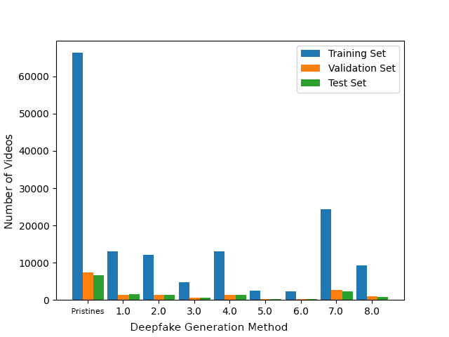


The dataset at the end of this process will have the following structure:

```
- ForgeryNet
    - faces
        - train
            - 1
                - video_name_0
                    0_0.png
                    1_0.png
                    2_0.png
                    ...
                    N_0.png
                ...
                - video_name_K
                    0_0.png
                    1_0.png
                    2_0.png
                    ...
                    M_0.png
            ...
            - 19
                - video_name_0
                    0_0.png
                    1_0.png
                    2_0.png
                    ...
                    S_0.png
                ...
                - video_name_Y
                    0_0.png
                    1_0.png
                    2_0.png
                    ...
                    J_0.png
        - val
            ...
                ...
                    ...

        - test
            ...
                ...
                    ...

```

This split was used only as an additional experimental field but all the reported results are obtained on the ForgeryNet Validation set.

### Identity Clustering
Having to manage multi-face videos and wanting to detect temporal and not just spatial anomalies, it is necessary to clustered the faces in each video on the basis of their similarity and maintaining the temporal order of their appearance in the frames. To do this, a clustering algorithm was developed that groups the faces extracted from the videos into sequences. 

To run the clustering split use the following commands:
```
cd preprocessing
python3 cluster_faces.py --faces_path path/to/faces
```

The algorithm is structured as follows:
- The features of each face are extracted via an InceptionResnetV1 pretrained on FaceNet;
- The distance between each face and all faces identified in the video is calculated;
- A graph is constructed with hard connection if the similarity is higher than the threshold;
- Clusters are obtained based on the graph and small clusters are discarded;
- The faces inside the clusters are temporally reordered;
- The clusters are enumerated based on mean faces size during data loading. 

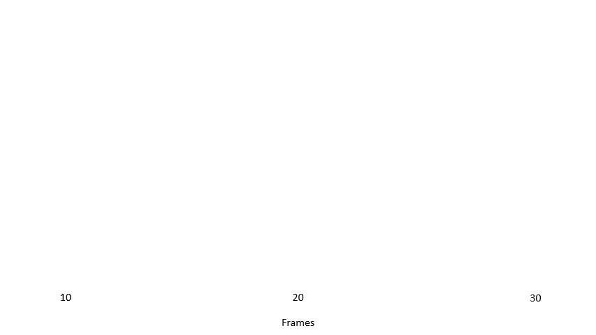


The following parameters can be changed as desired to achieve different clustering:
- --similarity_threshold: Threshold used to discard faces with high distance value (default 0.8);
- --valid_cluster_size_ratio: Valid cluster size percentage (default: 0.2)

The dataset at the end of this process will have the following structure:
```
- ForgeryNet
    - faces
        - train
            - 1
                - video_name_0
                    - identity_0
                        0_0.png
                        1_0.png
                        2_0.png
                        ...
                        D_0.png
                    ...
                    - identity_U
                        0_0.png
                        1_0.png
                        2_0.png
                        ...
                        T_0.png
                ...
                - video_name_K
                    - identity_0
                        0_0.png
                        1_0.png
                        2_0.png
                        ...
                        P_0.png
                    ...
                    - identity_X
                        0_0.png
                        1_0.png
                        2_0.png
                        ...
                        R_0.png
            ...
            - 19
                ...
                    ...
                        ...
        - val
            ...
                ...
                    ...
                        ...

        - test
            ...
                ...
                    ...
                        ...
```

## Training
After transforming each video in the dataset into temporally and spatially coherent sequences, one can move on to the training phase of the model.

To download the pretrained weights of the models you can run the following commands:
```
mkdir weights
cd weights
wget ...
wget ...
wget ...
```


If you are unable to use the previous urls you can download the weights from [Google Drive](https://drive.google.com/drive/folders/19bNOs8_rZ7LmPP3boDS3XvZcR1iryHR1?usp=sharing).


The network is trained to perform pristine/fake binary classification. The features are extracted from a pertrained EfficientNet B0 and the training of the TimeSformer is also influenced by the presence of an additional embedding, namely the size embedding. It is calculated from the face-frame area ratio for each face of the video and concatenated to each token obtained from it. 

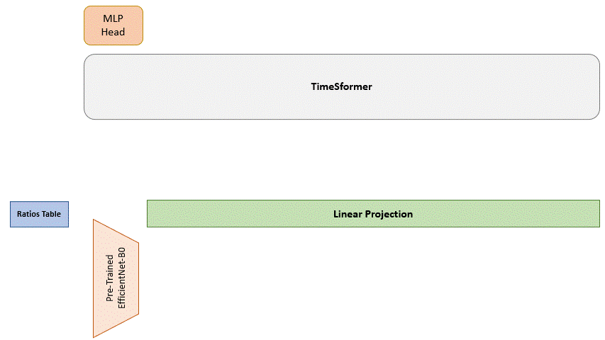

### Masking and Sampling
The number of frames per video, and thus consecutive faces to be considered for classification, is set via the num-frames parameter in the configuration file. In the event that there are fewer faces in the considered identity than necessary, more empty ones are added and then a mask is used to drive the calculation of attention properly. In the case of longer sequences, however, uniform sampling is performed. Like a kind of data augmentation, this uniform sampling is performed by alternating various combinations of frames as shown in figure.


 

### Adaptive Input Sequence Assignment
To enable the model to handle multiple identities within one video, the number of available frames is divided among the identities of the video.
The maximum number of identities per video is set via the max-identities parameter in the configuration file.

The identities are reordered according to the size of the faces within them, and the most important identities are given a higher number of frames to be exploited in the input sequence, in order to give more importance to faces that cover a larger area and are therefore likely to be more relevant in the video, as opposed to smaller faces.
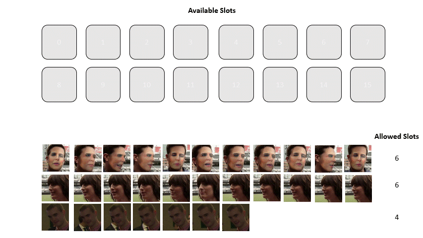


In the event that an identity does not have enough faces to satisfy the number of slots allocated to it, the remaining slots are inherited by the next identity. 
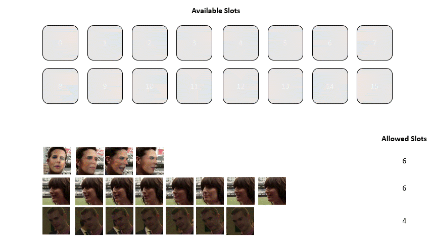


### Temporal Coherent Positional Embedding
Classical positional embedding was then evolved to ensure temporal consistency between frames as well as spatial consistency between tokens. 
Tokens are numbered in such a way that two faces, of different identities but belonging to the same frame, have the same numbering. 
Temporal coherence is maintained both locally by having an increasing numbering sequence as well as the frames from which the faces originate and globally by being generated on the basis of the global distribution of frames of all identities in the video.
In this first example, the two sequences are of the same length and have the same frame numbering. Therefore, the tokens are also numbered in the same way.
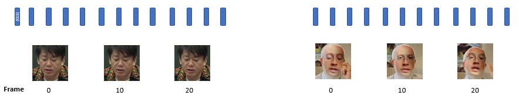

In example number two, however, although the two identities have the same number of faces, they are extracted from different frames. The numbering of the tokens therefore in this case, in addition to being generated by taking the sequentiality locally for each identity into account, is also assigned on the basis of the global distribution of frames.
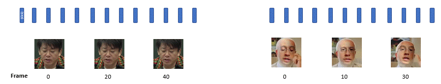

### Identity-based Attention Calculation
For our TimeSformer we apply the version of attention that was most effective in the original paper, namely Divided Space-Time Attention. Attention is calculated spatially between all patches in the same frame, but is then also calculated between the corresponding patches in the next and previous frames using a moving window. 

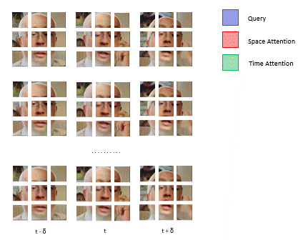

As far as spatial attention is concerned, no further effort is required for this to be applied to our case.  
Not being interested in capturing the relationships between faces of different identities, the calculation of temporal attention in our case is carried out exclusively between faces belonging to the same identity. 

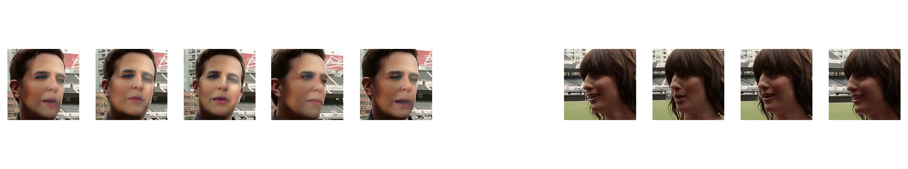

All faces, however, influence the CLS that is global and unique for all identities. 
In the animation below, it is shown how attention is calculated exclusively by tokens referring to identity 0 faces (green), ignoring those referring to identity 1 faces (red) and vice versa. While all refer to the global CLS.


### Multi-Face Size-Invariant TimeSformer


To run the training process use the following commands:
```
python3 train.py --config config/size_invariant_timesformer.yaml --model 1 --train_list_file path/to/training_list_file.txt --validation_list_file path/to/validation_list_file.txt --extractor_weights path/to/backbone_weights
```

The following parameters can be changed as desired to perform different training:
- --num_epochs: Number of training epochs (default: 300);
- --resume: Path to latest checkpoint (default: none);
- --restore_epoch: Restart from the checkpoint's epoch if --resume option specified (default: False)
- --freeze_backbone: Maintain the network freezed or train it (default: False);
- --extractor_unfreeze_blocks: Number of blocks to train in the backbone (default: All);
- --max_videos: Maximum number of videos to use for training (default: all);
- --patience: How many epochs wait before stopping for validation loss not improving (default: 5);
- --logger_name: Path to the folder for tensorboard logging (default: runs/train);


### Baseline 
To validate the real effectiveness of the implementation choices made on the presented architecture, we also conducted some alternative architecture training. In particular, the simplest of the two consists of a freezed EfficientNet-B0 pre-trained on the DFDC and FaceForensics++ datasets but whose output features, instead of going into a Transformer as in the original architecture, are given as input directly to a simple MLP. 
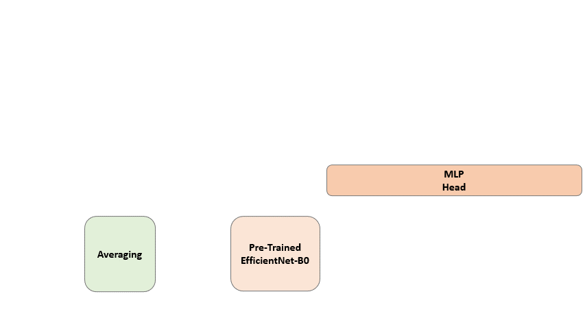

The MLP performs frame-by-frame classification for each face of the video and the predictions are then averaged and evaluated against a fixed threshold. 


## Inference
To run the evaluation process of a trained model on a test set, use the following command:
```
test.py --model_weights path/to/model  --extractor_weights path/to/model --video_path path/to/videos --data_path path/to/faces --test_list_file path/to/test.csv --model model_type --config path/to/config
```

You can also use the option --save_attentions to save space, time and combined attention plots.


## Additional Parameters
In almost all the scripts the following parameters can be also customized:

- --gpu_id: ID of GPU to use for processing or -1 to use multi-gpu only for the training (default: 0);
- --workers: Number of data loader workers (default: 8);
- --random_state: Random state number for reproducibility (default: 42)

# Reference
```
@misc{https://doi.org/10.48550/arxiv.2211.10996,
  doi = {10.48550/ARXIV.2211.10996},
  url = {https://arxiv.org/abs/2211.10996},
  author = {Coccomini, Davide Alessandro and Zilos, Giorgos Kordopatis and Amato, Giuseppe and Caldelli, Roberto and Falchi, Fabrizio and Papadopoulos, Symeon and Gennaro, Claudio},
  keywords = {Computer Vision and Pattern Recognition (cs.CV), FOS: Computer and information sciences, FOS: Computer and information sciences},
  title = {MINTIME: Multi-Identity Size-Invariant Video Deepfake Detection},
  publisher = {arXiv},
  year = {2022},
  copyright = {arXiv.org perpetual, non-exclusive license}
}
```
